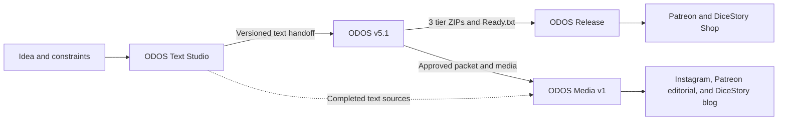

# ODOS Production Skills Archive

This is the preservation and education repository for the four Codex skills that make up the One Dollar One Shots production system.

The repository contains the actual skill instructions, supporting Python tools, contracts, configuration, and ODOS v5.1 visual reference assets. It also explains what each skill owns, what it produces, and how its output becomes the next skill's input.

## Start here

- [System architecture](docs/ARCHITECTURE.md) - responsibilities, boundaries, state, and handoffs
- [End-to-end runbook](docs/RUNBOOK.md) - the complete operational sequence
- [Preservation policy](docs/PRESERVATION.md) - snapshot, normalization, and restoration rules
- [Security notes](docs/SECURITY.md) - what must never enter source control
- [Integrity manifest](archive-manifest.json) - file sizes and SHA-256 hashes for preserved skill sources

## The four skills

| Skill | Responsibility | Main output | Source |
| --- | --- | --- | --- |
| ODOS Text Studio | Create and checkpoint the adventure's factual text foundation | Versioned text-only handoff | [`skills/odos-text-studio`](skills/odos-text-studio) |
| ODOS v5.1 | Compile the handoff into image-generated packet pages and tier distributions | Basic, Deluxe, and Premium ZIPs plus `Ready.txt` | [`skills/odosv5-1`](skills/odosv5-1) |
| ODOS Release | Validate and publish the oldest eligible product | Verified shop product and Patreon fulfillment posts | [`skills/odos-release`](skills/odos-release) |
| ODOS Media v1 | Build a source-locked editorial campaign for the newest completed product | 12 Instagram posts, 3 Patreon articles, and 1 DiceStory blog article | [`skills/odos-media-v1`](skills/odos-media-v1) |

## How they interconnect



Text Studio and v5.1 form the product-making spine. Release and Media are sibling consumers of the approved packet; neither is a prerequisite for the other.

One intentional selection difference matters:

- Release chooses the **oldest unpublished valid** packet and enforces the weekly limit.
- Media chooses the **newest completed valid** packet and locks its campaign to that source fingerprint.

## Repository structure

```text
.
|-- README.md
|-- LICENSE.md
|-- archive-manifest.json
|-- docs/
|   |-- ARCHITECTURE.md
|   |-- PRESERVATION.md
|   |-- RUNBOOK.md
|   `-- SECURITY.md
|-- skills/
|   |-- odos-text-studio/
|   |-- odosv5-1/
|   |-- odos-release/
|   `-- odos-media-v1/
`-- scripts/
    |-- build-manifest.ps1
    `-- verify-archive.ps1
```

Each skill directory preserves its `SKILL.md`, referenced documents, scripts, configuration, agent metadata, and supplied assets. Generated Python caches are excluded.

## Approval boundaries

The pipeline uses a small number of high-leverage human gates:

1. Choose one Style, one Quest, and one Antagonist in Text Studio.
2. Approve the v5.1 character, action scene, complete Scene page, and battle-map proofs together.
3. Explicitly authorize external product publication.
4. Review and approve the exact Media campaign snapshot before scheduling or posting.

Everything between those gates is resumable through explicit state, hashes, validation, and recorded QA evidence.

## Preservation and privacy

The public snapshot contains three documented normalizations:

- Machine-specific Text Studio paths use a portable user-home path.
- One inactive fallback email uses `alerts@example.invalid`.
- Generated Python bytecode caches are omitted.

Runtime state, generated adventures, customer ZIPs, release ledgers, credentials, browser sessions, cookies, and one-time codes are not archived.

## Verify the archive

On Windows PowerShell:

```powershell
powershell -ExecutionPolicy Bypass -File .\scripts\verify-archive.ps1
```

Rebuild the integrity ledger after an intentional source snapshot update:

```powershell
powershell -ExecutionPolicy Bypass -File .\scripts\build-manifest.ps1
```

## License status

The repository is currently published for preservation, inspection, and educational reading under the terms in [LICENSE.md](LICENSE.md). No broader reuse license is granted unless the repository owner replaces that notice.
